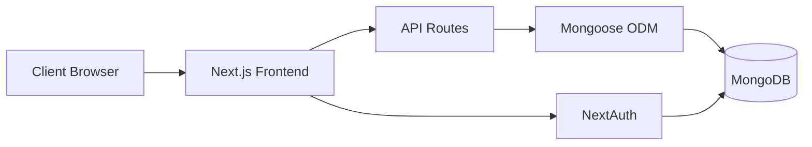

<div align="center">

# 🚀 Smith Marketing Agency
### *Enterprise CRM System*


**A powerful, modern Customer Relationship Management system with full-featured dashboard, analytics, and seamless client management.**

[🎯 Features](#-key-features) • [🚀 Quick Start](#-quick-start) • [📖 Documentation](#-project-structure) • [🛠️ Tech Stack](#️-tech-stack)

---

</div>

## 📁 Project Structure

<details>
<summary><b>📂 Click to view complete directory structure</b></summary>

<br>

```
smiths-crm/
│
├── 🧩 components/              # React components organized by feature
│   ├── 👥 customers/          # Customer-related components
│   │   ├── AddCustomerPage.js
│   │   ├── Card.js            # Customer card display component
│   │   ├── CustomerDetailsPage.js
│   │   ├── CustomerEditPage.js
│   │   ├── Form.js            # Customer form component
│   │   └── HomePage.js        # Customer listing page
│   ├── 🎨 layout/             # Layout components
│   │   └── Layout.js          # Main app layout with navigation
│   └── 🔧 ui/                 # Reusable UI components
│       └── FormInput.js       # Generic form input component
│
├── 📊 models/                  # Mongoose data models
│   ├── Campaign.js            # Marketing campaign model
│   ├── Client.js              # Client model
│   ├── Contact.js             # Contact model
│   ├── Customer.js            # Customer model
│   ├── Lead.js                # Lead model
│   ├── Project.js             # Project model
│   ├── Task.js                # Task model
│   ├── TeamMember.js          # Team member model
│   └── User.js                # User authentication model
│
├── 📄 pages/                   # Next.js pages (routes)
│   ├── _app.js                # App wrapper with SessionProvider
│   ├── index.js               # Root redirect to dashboard
│   ├── login.js               # Login page
│   ├── dashboard.js           # Main dashboard
│   ├── home.js                # Customer home page
│   ├── users.js               # User management page
│   │
│   ├── 📢 campaigns/          # Campaign CRUD pages
│   ├── 👥 clients/            # Client CRUD pages
│   ├── 📇 contacts/           # Contact CRUD pages
│   ├── 🎣 leads/              # Lead CRUD pages
│   ├── 📋 projects/           # Project CRUD pages
│   ├── ✅ tasks/              # Task CRUD pages
│   ├── 👔 team/               # Team member CRUD pages
│   │
│   └── 🔌 api/                # API routes
│       ├── seed.js            # Sample data seeding endpoint
│       ├── auth/
│       │   └── [...nextauth].js    # NextAuth configuration
│       ├── campaign/          # Campaign API endpoints
│       ├── client/            # Client API endpoints
│       ├── contact/           # Contact API endpoints
│       ├── customer/          # Customer API endpoints
│       ├── lead/              # Lead API endpoints
│       ├── project/           # Project API endpoints
│       ├── task/              # Task API endpoints
│       ├── team/              # Team API endpoints
│       └── users/             # User API endpoints
│
├── 🎨 styles/                  # Global styles
│   └── globals.css            # Global CSS with Tailwind
│
├── 🛠️ utils/                   # Utility functions
│   ├── connectDB.js           # MongoDB connection utility
│   └── seedAdmin.js           # Admin user seeding script
│
├── 🖼️ public/                  # Static assets
├── ⚙️ Config files
│   ├── .env.local             # Environment variables (not in git)
│   ├── .gitignore             # Git ignore rules
│   ├── next.config.js         # Next.js configuration
│   ├── package.json           # Dependencies and scripts
│   ├── pnpm-lock.yaml         # pnpm lock file
│   ├── postcss.config.js      # PostCSS configuration
│   └── tailwind.config.js     # Tailwind CSS configuration
```

</details>

### 🏗️ Architecture Highlights



**Component Organization Strategy:**
- 📦 **Feature-based** - Components grouped by domain (customers, layout, ui)
- 🔄 **Reusability** - Shared UI components in dedicated folder
- 🎯 **Separation of Concerns** - Clear boundaries between pages, components, and logic

## 🚀 Quick Start

### 📋 Prerequisites

Before you begin, ensure you have the following installed:

| Requirement | Version | Download |
|------------|---------|----------|
| 🟢 Node.js | 18+ | [nodejs.org](https://nodejs.org/) |
| 📦 pnpm | Latest | `npm install -g pnpm` |
| 🍃 MongoDB | 6+ | [mongodb.com](https://www.mongodb.com/) |

### ⚡ Installation

<details open>
<summary><b>Step-by-step setup guide</b> 👇</summary>

<br>

**1️⃣ Clone & Install**
```bash
git clone <your-repo-url>
cd smiths-crm
pnpm install
```

**2️⃣ Environment Configuration**

Create a `.env.local` file in the root directory:

```env
# Database
MONGODB_URI=mongodb://localhost:27017/smiths-crm

# NextAuth Configuration
NEXTAUTH_URL=http://localhost:3000
NEXTAUTH_SECRET=your-super-secret-key-change-this

# Optional: Additional Configuration
NODE_ENV=development
```

> 💡 **Tip**: Generate a secure secret with: `openssl rand -base64 32`

**3️⃣ Database Setup**

Seed the admin user:
```bash
pnpm seed
```

**Default Admin Credentials:**
```
📧 Email: admin@smithsagency.com
🔑 Password: admin123
```

> ⚠️ **Important**: Change the default password after first login!

**4️⃣ Launch Application**
```bash
pnpm dev
```

**5️⃣ Access the App**

Open your browser and navigate to:
```
🌐 http://localhost:3000
```

</details>

### 🎬 Additional Commands

```bash
# Start development server
pnpm dev

# Build for production
pnpm build

# Start production server
pnpm start

# Seed admin user
pnpm seed

# Run linter
pnpm lint
```

## ✨ Key Features

<table>
<tr>
<td width="50%">

### 📊 Core Modules
- 🎯 **Dashboard** - Real-time metrics & analytics
- 👥 **Client Management** - Full CRUD operations
- 🎣 **Lead Tracking** - Convert leads to clients
- 📋 **Project Management** - Track deliverables
- ✅ **Task Management** - Team collaboration

</td>
<td width="50%">

### 🔧 Advanced Features
- 📢 **Campaign Tracking** - Marketing ROI
- 👔 **Team Management** - Resource allocation
- 📇 **Contact System** - Organized directory
- 🔐 **Authentication** - Role-based access
- 📈 **Analytics** - Business insights

</td>
</tr>
</table>

### 🎨 User Experience Highlights

> ⚡ **Lightning Fast** - Built on Next.js 14 for optimal performance  
> 🎯 **Intuitive UI** - Clean, modern design with Tailwind CSS  
> 🔒 **Secure** - NextAuth.js authentication with role-based permissions  
> 📱 **Responsive** - Works seamlessly on desktop, tablet, and mobile  
> 🔄 **Real-time** - Live updates across all modules

## 🛠️ Tech Stack

<div align="center">

### Frontend Architecture
| Technology | Purpose | Version |
|-----------|---------|---------|
| ⚛️ **React** | UI Framework | 18.2.0 |
| ▲ **Next.js** | React Framework | 14.2.18 |
| 🎨 **Tailwind CSS** | Styling | 3.4.0 |
| 🎭 **NextAuth.js** | Authentication | 4.24.13 |

### Backend & Database
| Technology | Purpose | Version |
|-----------|---------|---------|
| 🍃 **MongoDB** | Database | - |
| 🦫 **Mongoose** | ODM | 6.9.0 |
| 🔐 **bcryptjs** | Password Hashing | 3.0.3 |
| ⏰ **Moment.js** | Date Management | 2.29.4 |

### Development Tools
| Tool | Purpose |
|------|---------|
| 📦 **pnpm** | Package Manager |
| 🔧 **PostCSS** | CSS Processing |
| ⚡ **Autoprefixer** | CSS Compatibility |

</div>

## � Data Models & Architecture

<details>
<summary><b>📊 Database Schema Overview</b></summary>

<br>

### Core Entities

| Model | Description | Key Fields |
|-------|-------------|------------|
| 👤 **User** | System authentication | email, password, role |
| 👥 **Client** | Primary customer entity | companyName, tier, status |
| 🎯 **Lead** | Sales pipeline | status, source, value |
| 📋 **Project** | Client engagements | title, budget, deadline |
| ✅ **Task** | Work items | assignee, priority, status |
| 📢 **Campaign** | Marketing initiatives | budget, ROI, metrics |
| 📇 **Contact** | Individual contacts | name, email, client |
| 👔 **TeamMember** | Internal staff | role, department |

### 💡 Architecture Notes

> **Customer vs Client**  
> Both models exist for backward compatibility. **Client** (`/clients`) is the primary feature with full functionality. **Customer** (`/home`, `/customer/[id]`) represents legacy routes that remain functional but are not actively promoted in navigation.

</details>

## 🔐 Authentication & Security

The application implements enterprise-grade security:

```javascript
// NextAuth.js with Credentials Provider
🔑 Session-based authentication
👥 Role-based access control (RBAC)
🔒 Bcrypt password hashing
🛡️ Protected API routes
🚪 Automatic route guards
```

**Access Levels:**
- 👑 **Admin** - Full system access, user management, all CRUD operations
- 👤 **User** - Limited access (configurable per module)
- 🚫 **Guest** - Redirected to login page

## 📌 Important Notes

<table>
<tr>
<td>

**📦 Package Manager**
- Uses `pnpm` exclusively
- `package-lock.json` & `yarn.lock` are gitignored
- Consistent dependency management

</td>
<td>

**🗃️ Database Seeding**
- Admin script: `utils/seedAdmin.js`
- Sample data: `pages/api/seed.js`
- Never modified during cleanup

</td>
</tr>
<tr>
<td>

**🔄 Legacy Routes**
- Customer routes (`/home`, `/add-customer`)
- Still functional but hidden
- Client routes are primary

</td>
<td>

**🏗️ Code Organization**
- Feature-based structure
- Clear separation of concerns
- Scalable & maintainable

</td>
</tr>
</table>

## 🧹 Recent Updates

<details>
<summary><b>✨ What's New (February 2026)</b></summary>

<br>

### Cleanup & Reorganization

- ✅ Removed unused components (`ItemList.js`)
- ✅ Reorganized components into feature-based directories
- ✅ Standardized on pnpm package manager
- ✅ Updated all import paths to new structure
- ✅ Verified all routes are active (no orphaned pages)
- ✅ Cleaned up lock files
- ✅ Added comprehensive documentation

### Architecture Improvements

- 📁 Better folder structure
- 🎯 Feature-based component organization
- 📝 Improved code readability
- 🔧 Optimized imports

</details>

## 🤝 Contributing

We welcome contributions! Here's how you can help:

<details>
<summary><b>📝 Contribution Guidelines</b></summary>

<br>

1. **Fork the repository**
2. **Create a feature branch**
   ```bash
   git checkout -b feature/amazing-feature
   ```
3. **Make your changes**
4. **Commit with clear messages**
   ```bash
   git commit -m "Add: amazing feature description"
   ```
5. **Push to your branch**
   ```bash
   git push origin feature/amazing-feature
   ```
6. **Open a Pull Request**

### 📋 Commit Convention

- `Add:` New feature
- `Fix:` Bug fix
- `Update:` Modify existing feature
- `Remove:` Delete code/files
- `Docs:` Documentation changes

</details>

## 📞 Support & Contact

<div align="center">

**Need help? Have questions?**

[](mailto:support@smithsagency.com)
[](https://github.com/your-repo/issues)

</div>

## 📄 License

<div align="center">

**Smith Marketing Agency CRM System**  
Version 0.1.0

```
MIT License - Feel free to use this project for your own purposes
```

---

### ⭐ Star this repo if you find it useful!

**Made with ❤️ by the Smith Marketing Agency Team**

<sub>Copyright © 2026 Smith Marketing Agency. All rights reserved.</sub>

</div>
